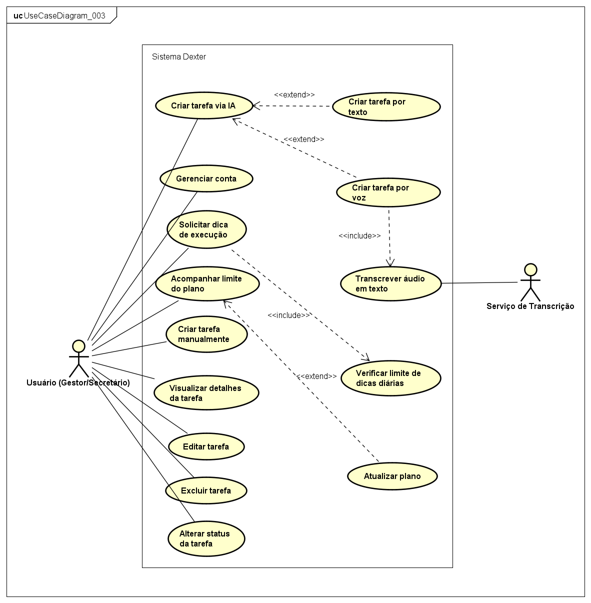

# Diagrama de Casos de Uso - Sistema Dexter

Esta seção documenta as interações mapeadas entre os atores e as funcionalidades do Sistema Dexter.

*(Certifique-se de que o caminho da imagem aponta para onde você salvou o PNG)*

## 1. Atores

* **Usuário (Gestor/Secretário):** Ator principal que interage com o aplicativo para gerenciar sua rotina e tarefas diárias.
* **Serviço de Transcrição:** Sistema secundário (API FastAPI + Faster-Whisper) que atua de forma invisível para o usuário, processando o áudio e devolvendo o texto.

## 2. Descrição dos Fluxos Principais

### Fluxo de IA e Automação
* **Criar tarefa via IA:** Fluxo central onde o sistema interpreta a intenção do usuário para agendar a tarefa. 
  * **<<extend>> (Variações):** O usuário pode iniciar este fluxo opcionalmente através de **Criar tarefa por texto** ou **Criar tarefa por voz**.
  * **<<include>> (Obrigatoriedade):** Se o fluxo for iniciado por voz, o sistema aciona obrigatoriamente a funcionalidade **Transcrever áudio em texto** através do Serviço de Transcrição.

### Fluxo de Auxílio e Produtividade
* **Solicitar dica de execução:** O usuário pede à IA sugestões de como realizar uma tarefa complexa.
  * **<<include>> (Obrigatoriedade):** Antes de gerar a dica, o sistema executa a rotina **Verificar limite de dicas diárias** para garantir que o plano do usuário permite a ação.

### Fluxo de Monetização (SaaS)
* **Acompanhar limite do plano:** O usuário visualiza o consumo de suas cotas diárias de tarefas e dicas.
  * **<<extend>> (Variação):** Durante o acompanhamento, o usuário pode, opcionalmente, acionar o fluxo **Atualizar plano** para obter mais limite.

### Fluxos de Gestão Manual (CRUD)
Ações de rotina que o usuário pode executar diretamente na interface sem a intervenção da IA:
* **Gerenciar conta:** Autenticação e configurações de perfil.
* **Criar tarefa manualmente:** Preenchimento de formulário padrão sem usar o assistente.
* **Visualizar detalhes da tarefa:** Consulta de prazos, descrições e status.
* **Editar tarefa / Excluir tarefa:** Modificação ou remoção de compromissos da agenda.
* **Alterar status da tarefa:** Movimentação da tarefa (ex: de "Pendente" para "Concluída").